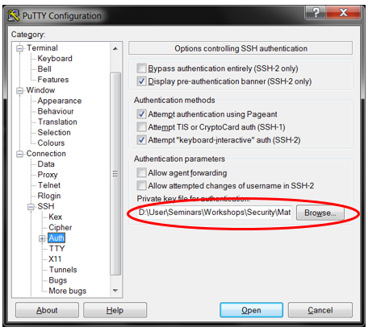

# Accessing Labs Enviroment #

In this chapter, we will connect to the labs environment and make sure we are ready for the hands-on.
Your environment is hosted on Oracle Cloud Infrastructure with the following virtual machines as intances on IaaS:

- **dbclient**: a simple client application with both 11gR2, 12cR2 and 18c instant clients. We can use it for some of the labs (e.g. when setting up network encryption)
- **secdb**: a Linux box hosting an Oracle Database 18c with a pluggable database PDB1 and most of the labs scripts: they are designed to be easily re-usable
- **av**: an Audit Vault Server 12.2 which will be configured as part of the labs
- **emcc**: an Enterprise Manager Cloud Control 13cR2 whose agent is deployed on secdb

The virtual machines can be used accessing with a SSH Client (Putty, MobaXterm) or with `ssh` on the command line (bash, mac or linux).
For secdb, the Virtual Cloud Network (**VNC**) is also configured to access a graphical environment.

## Disclaimer ##
The following is intended to outline our general product direction. It is intended for information purposes only, and may not be incorporated into any contract. It is not a commitment to deliver any material, code, or functionality, and should not be relied upon in making purchasing decisions. The development, release, and timing of any features or functionality described for Oracle’s products remains at the sole discretion of Oracle.

## Requirements ##

Access to the OCI tenancy, provided by the instructor.
Private key to access via SSH with the client.
Optionally for secdb, a VNC client.

## Step 1: Connect to OCI Console ##
Connect to the OCI using **OraclePartnerSAS** tenant:

https://console.us-phoenix-1.oraclecloud.com/?tenant=OraclePartnerSAS#/a/

The user name and password will be provided by your instructor.

### Get the Instance listing

Once your are connected into the OCI console, select from the Menu->Core Infrastructure->Compute->Instances

On the **List Scope** section, choose the **COMPARTMENT** assigned to you by the instructor.

### Copy the Public Address

Here you can see the public IP Address assigned to each of your instances.

These IP Addresses will be used to connect with SSH client.

## Connect to the instances

Using the Public Address, open a ssh client like Putty and connect to the instance

Connect with **oracle** User

## Acknowledgements

**Authors** 

- Adrian Galindo, PTS LAD & François Pons, PTS EMEA - Database Product Management - April 2020.