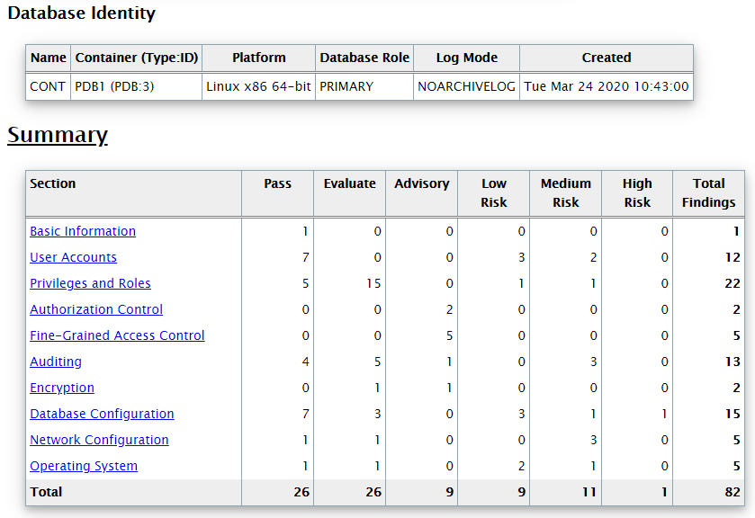
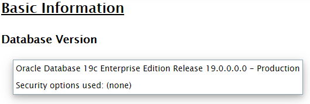
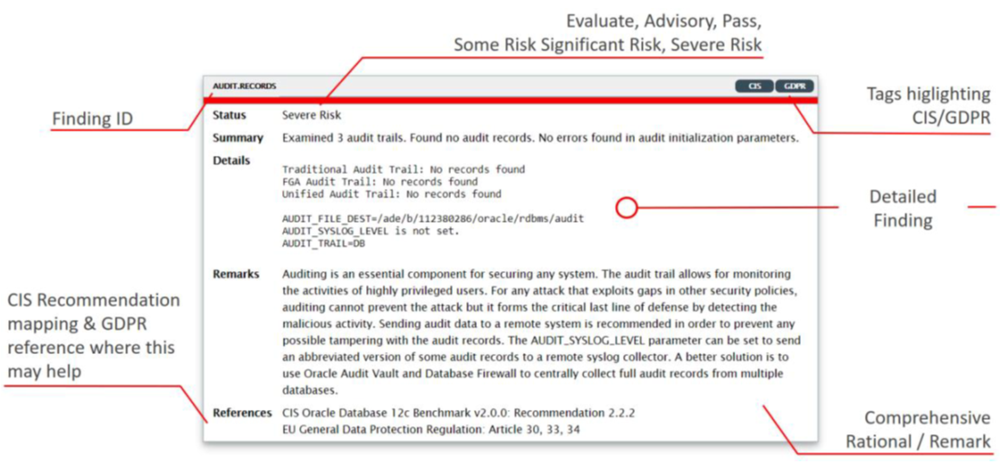
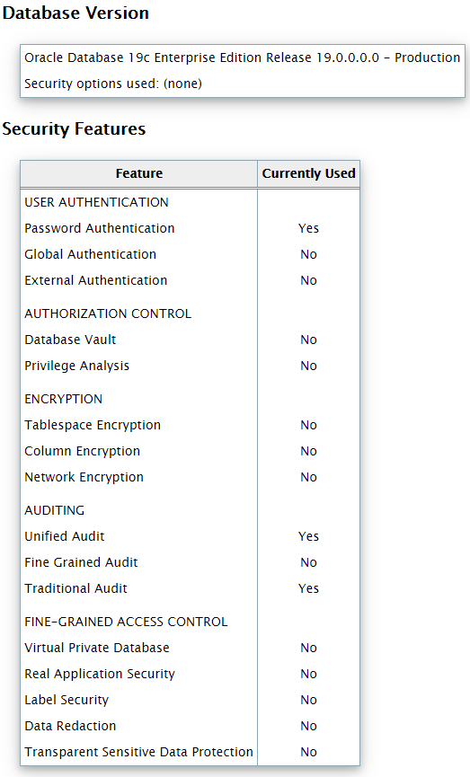
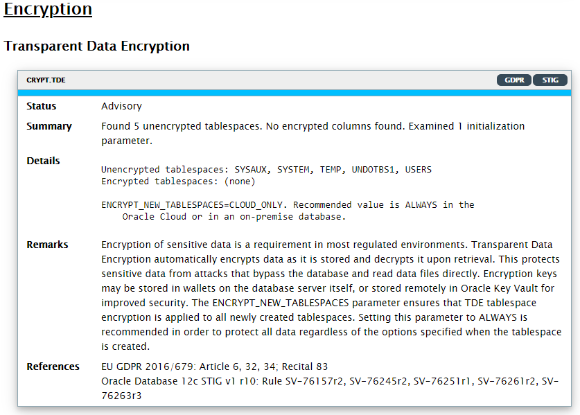

# Lab 1: Database Security Assessment Tool

The Oracle Database Security Assessment Tool (DBSAT) identifies sensitive data, analyzes database configurations, users, their entitlements and security policies to uncover security risks and improve the security posture of Oracle Databases within your organization. You can use DBSAT to implement and enforce security best practices in your organization and accelerate compliance with regulations such as the EU GDPR. 

DBSAT reports on existing sensitive data, the state of user accounts, role and privilege grants, and policies that control the use of various security features in the database. 

DBSAT generates two types of reports: 
- Database Security Risk Assessment report 
- Database Sensitive Data Assessment report 

You can use report findings to: 
- Fix immediate short-term risks 
- Implement a comprehensive security strategy 


## Requirements ##

- Lab 0: "Accessing to Labs environment" completed. 
- Session open to **secdb** with user **oracle**
- session open to **dbclient** with user **oracle**  

## Step 1: Installing DBSAT

We will now install and run DBSAT on PDB1 in Container Database CONT.

### Create a DBSAT user with appropiate privileges

Go to the session opened to the secdb server.

Change to the lab directory

    [oracle@secdb ~ ]$ <copy>cd /home/oracle/HOL/lab01_dbsat/</copy>

Run `dbsat10_user.sh` to create a DBSAT local user with appropriate privileges.

```
[oracle@secdb lab01_dbsat]$ <copy>./dbsat10_user.sh</copy>

SQL*Plus: Release 19.0.0.0.0 - Production on Sat Apr 25 02:15:24 2020
Version 19.6.0.0.0

Copyright (c) 1982, 2019, Oracle.  All rights reserved.

Connected.
SQL> alter session set container=pdb1;

Session altered.

SQL> --drop user dbsat cascade;
SQL> grant create session to dbsat identified by "MyDbPwd#1";

Grant succeeded.

SQL> grant select on sys.registry$history to dbsat;

Grant succeeded.

SQL> grant select_catalog_role to dbsat;

Grant succeeded.

SQL> -- if Database Vault has been enabled
SQL> grant dv_secanalyst to dbsat;

Grant succeeded.

SQL> -- 12c/18c/19c only
SQL> grant audit_viewer to dbsat;

Grant succeeded.

SQL> grant capture_admin to dbsat;

Grant succeeded.

SQL> -- 11g and 12c/18c/19c
SQL> grant select on sys.dba_users_with_defpwd to dbsat;

Grant succeeded.

SQL> -- 12c/18c/19c only
SQL> grant select on audsys.aud$unified to dbsat;

Grant succeeded.

SQL> exit
Disconnected from Oracle Database 19c Enterprise Edition Release 19.0.0.0.0 - Production
Version 19.6.0.0.0
```

We will now install and run DBSAT on pluggable database PDB1 in Container Database CONT.

### Unzip DBSAT distribution

The installation is a simple process. Execute the `./dbsat20_install.sh` script:

```
[oracle@secdb lab01_dbsat]$ <copy>./dbsat20_install.sh</copy>
Archive:  dbsat.zip
  inflating: dbsat/install/dbsat
  inflating: dbsat/install/dbsat.bat
  inflating: dbsat/install/sat_collector.sql
  inflating: dbsat/install/sat_reporter.py
  inflating: dbsat/install/sat_analysis.py
  inflating: dbsat/install/xlsxwriter/app.py
  inflating: dbsat/install/xlsxwriter/chart_area.py
  inflating: dbsat/install/xlsxwriter/chart_bar.py
  inflating: dbsat/install/xlsxwriter/chart_column.py
  inflating: dbsat/install/xlsxwriter/chart_doughnut.py
  inflating: dbsat/install/xlsxwriter/chart_line.py
  inflating: dbsat/install/xlsxwriter/chart_pie.py
  inflating: dbsat/install/xlsxwriter/chart.py
  inflating: dbsat/install/xlsxwriter/chart_radar.py
  inflating: dbsat/install/xlsxwriter/chart_scatter.py
  inflating: dbsat/install/xlsxwriter/chartsheet.py
  inflating: dbsat/install/xlsxwriter/chart_stock.py
  inflating: dbsat/install/xlsxwriter/comments.py
  inflating: dbsat/install/xlsxwriter/compatibility.py
  inflating: dbsat/install/xlsxwriter/contenttypes.py
  inflating: dbsat/install/xlsxwriter/core.py
  inflating: dbsat/install/xlsxwriter/custom.py
  inflating: dbsat/install/xlsxwriter/drawing.py
  inflating: dbsat/install/xlsxwriter/exceptions.py
  inflating: dbsat/install/xlsxwriter/format.py
  inflating: dbsat/install/xlsxwriter/__init__.py
  inflating: dbsat/install/xlsxwriter/packager.py
  inflating: dbsat/install/xlsxwriter/relationships.py
  inflating: dbsat/install/xlsxwriter/shape.py
  inflating: dbsat/install/xlsxwriter/sharedstrings.py
  inflating: dbsat/install/xlsxwriter/styles.py
  inflating: dbsat/install/xlsxwriter/table.py
  inflating: dbsat/install/xlsxwriter/theme.py
  inflating: dbsat/install/xlsxwriter/utility.py
  inflating: dbsat/install/xlsxwriter/vml.py
  inflating: dbsat/install/xlsxwriter/workbook.py
  inflating: dbsat/install/xlsxwriter/worksheet.py
  inflating: dbsat/install/xlsxwriter/xmlwriter.py
  inflating: dbsat/install/xlsxwriter/LICENSE.txt
  inflating: dbsat/install/Discover/bin/discoverer.jar
  inflating: dbsat/install/Discover/lib/ojdbc8.jar
  inflating: dbsat/install/Discover/lib/oraclepki.jar
  inflating: dbsat/install/Discover/lib/osdt_cert.jar
  inflating: dbsat/install/Discover/lib/osdt_core.jar
  inflating: dbsat/install/Discover/conf/sample_dbsat.config
  inflating: dbsat/install/Discover/conf/sensitive_en.ini
  inflating: dbsat/install/Discover/conf/sensitive_es.ini
  inflating: dbsat/install/Discover/conf/sensitive_de.ini
  inflating: dbsat/install/Discover/conf/sensitive_pt.ini
  inflating: dbsat/install/Discover/conf/sensitive_it.ini
  inflating: dbsat/install/Discover/conf/sensitive_fr.ini
  inflating: dbsat/install/Discover/conf/sensitive_nl.ini
  inflating: dbsat/install/Discover/conf/sensitive_el.ini
  [oracle@secdb lab01_dbsat]$
```

Validate that the unzipped files match the following list:

```
[oracle@secdb lab01_dbsat]$ <copy>cd dbsat/install/</copy>
[oracle@secdb install]$ ls -l
total 396
-r-xr-xr-x. 1 oracle oinstall  13270 Aug 12  2019 dbsat
-r-xr-xr-x. 1 oracle oinstall  13614 Sep 11  2019 dbsat.bat
drwxr-xr-x. 5 oracle oinstall     40 Apr 25 02:22 Discover
-rw-rw-r--. 1 oracle oinstall  24935 Sep 11  2019 sat_analysis.py
-rw-rw-r--. 1 oracle oinstall  58661 Sep 11  2019 sat_collector.sql
-rw-rw-r--. 1 oracle oinstall 276258 Sep 11  2019 sat_reporter.py
drwxr-xr-x. 2 oracle oinstall   4096 Apr 25 02:22 xlsxwriter
```
## Step 2: Run DBSAT Collector and Reporter 

DBSAT collector will connect to the database and collect data needed for analysis. DBSAT will not create any objects in the database. DBSAT only executes queries similar to the ones a Database Administrator would be executing in his daily tasks.

### Run DBSAT Collector
To run DBSAT collector, we will use script `dbsat30_collect.sh`, which contains the full command line:

***dbsat collect dbsat/"[password]"@PDB1 dbsat_pdb1***

The time it takes to complete depends on the hardware and the data that needs to be collected. It might take between 2 to 5 minutes. At the end of the process, you will be asked to provide a password twice (please use **oracle**) to protect the report file dbsat_pdb1.zip. Below is the expected output:

    [oracle@secdb ~]$ <copy>cd /home/oracle/HOL/lab01_dbsat</copy>

```
[oracle@secdb lab01_dbsat]$ <copy>./dbsat30_collect.sh</copy>

Database Security Assessment Tool version 2.2 (September 2019)

This tool is intended to assist you in securing your Oracle database
system. You are solely responsible for your system and the effect and
results of the execution of this tool (including, without limitation,
any damage or data loss). Further, the output generated by this tool may
include potentially sensitive system configuration data and information
that could be used by a skilled attacker to penetrate your system. You
are solely responsible for ensuring that the output of this tool,
including any generated reports, is handled in accordance with your
company's policies.

Connecting to the target Oracle database...


SQL*Plus: Release 19.0.0.0.0 - Production on Mon Apr 27 18:29:20 2020
Version 19.6.0.0.0

Copyright (c) 1982, 2019, Oracle.  All rights reserved.


Connected to:
Oracle Database 19c Enterprise Edition Release 19.0.0.0.0 - Production
Version 19.6.0.0.0

Setup complete.
SQL queries complete.
OS commands complete.
Disconnected from Oracle Database 19c Enterprise Edition Release 19.0.0.0.0 - Production
Version 19.6.0.0.0
DBSAT Collector completed successfully.

Calling /u01/oracle/db/prod/19c/ee/bin/zip to encrypt dbsat_pdb1.json...
```

    Enter password: <copy>oracle</copy>

    Verify password: <copy>oracle</copy>
      adding: dbsat_pdb1.json (deflated 86%)
    zip completed successfully.


### Run DBSAT Reporter

DBSAT reporter will take as input the file generated by the collector (json or zip file) and will produce one zip file containing four reports in different formats: HTML, spreadsheet, JSON and text. If you choose not to encrypt data, the four report files will be generated in the specified directory.

To run DBSAT discoverer, we will use script `dbsat40_report.sh`, which contains the full command line:

***dbsat report dbsat_pdb1***

At the beginning and end of the process, you will be asked to provide a password. Please use oracle.
Below is the expected output:

    [oracle@secdb lab01_dbsat]$ <copy>cd /home/oracle/HOL/lab01_dbsat</copy>

```
[oracle@secdb lab01_dbsat]$ <copy>./dbsat40_report.sh</copy>

Database Security Assessment Tool version 2.2 (September 2019)

This tool is intended to assist you in securing your Oracle database
system. You are solely responsible for your system and the effect and
results of the execution of this tool (including, without limitation,
any damage or data loss). Further, the output generated by this tool may
include potentially sensitive system configuration data and information
that could be used by a skilled attacker to penetrate your system. You
are solely responsible for ensuring that the output of this tool,
including any generated reports, is handled in accordance with your
company's policies.

Archive:  dbsat_pdb1.zip
[dbsat_pdb1.zip] dbsat_pdb1.json password: <copy>oracle</copy>
  inflating: dbsat_pdb1.json
DBSAT Reporter ran successfully.

Calling /usr/bin/zip to encrypt the generated reports...
```

    Enter password: <copy>oracle</copy>

    Verify password: <copy>oracle</copy>
          zip warning: dbsat_pdb1_report.zip not found or empty
      adding: dbsat_pdb1_report.txt (deflated 78%)
      adding: dbsat_pdb1_report.html (deflated 84%)
      adding: dbsat_pdb1_report.xlsx (deflated 3%)
      adding: dbsat_pdb1_report.json (deflated 82%)
    zip completed successfully.


Unzip the report file to be able to check the contents by opening it in Firefox. You will be asked for the password to unzip. Input `oracle` when requested. 


    [oracle@secdb lab01_dbsat]$ <copy>cd /home/oracle/HOL/lab01_dbsat/dbsat/install</copy>

    [oracle@secdb install]$ <copy>unzip dbsat_pdb1_report.zip</copy>
    Archive:  dbsat_pdb1_report.zip

    [dbsat_pdb1_report.zip] dbsat_pdb1_report.txt password: <copy>oracle</copy>
      inflating: dbsat_pdb1_report.txt
      inflating: dbsat_pdb1_report.html
      inflating: dbsat_pdb1_report.xlsx
      inflating: dbsat_pdb1_report.json

### Explore Database Security Risk Assessment Report

If you are inside the graphical environment connected through VNC, launch the browser and open the html file generated: **dbsat_pdb1_report.html**

*Note: In case tou are working on the command line outside the VNC, you can use WinSCP or another tool to copy the file to your local computer. Connect as oracle / MyDbPwd#1 and specify the private key to authenticate.*

Please take a couple of minutes to scroll through the html report. You can click the links in the summary table to go to a specific section or use the navigation arrows at the bottom right. 

The report contains *informational tables*, as the one shown below and *findings*. We will get back to the findings later. Informational tables provide either summary information or additional context to the findings in the same section.


At the top of the report, you will find information about the Collector and Reporter run details as the date of *data collection* and the *date of report* generation along with the reporter version.
The Summary table presents all the findings per section/domain along with their severity level. 






The DBSAT reporter resulting analysis is reported in units called ***Findings***. In each Finding you see: 

**Unique ID for the Rule** The ID has two parts: the prefix identifies the report section, and the suffix identifies the specific rule. 

**Status** You can use the status values as guidelines for implementing DBSAT recommendations. They can be used to prioritize and schedule changes based on the level of risk, and what it might mean to your organization. High risk might require immediate remedial action, whereas other risks might be fixed during a scheduled downtime, or bundled together with other maintenance activities. 

- Pass: no error found 
- Evaluate: needs manual analysis 
- Low Risk 
- Medium Risk 
- High Risk 
- Advisory: improve security posture by enabling additional security features and technology. 

**Summary** A brief summary of the finding. When the finding is informational, the summary typically reports only the number of data elements that were examined.

**Details** Provides detailed information to explain the finding summary, typically results from the assessed database, followed by any recommendations for changes. 

**Remarks** Explains the reason for the rule and recommended actions for remediation. 

**References** If the finding is related to a CIS Oracle Database Benchmark 12c v2.0.0 recommendation or related to a GDPR Article/Recitals it will be mentioned here.



Currently, our PDB1 database is not using many security features at all!



In the next chapters, we will follow some of DBSAT’s Advisory findings to strengthen the security of our database. For example, in the Encryption section, DBSAT recommends to consider encrypting data:



## Step 3: Running DBSAT Discoverer

DBSAT Discoverer quickly provides a view on where sensitive data resides, which is helpful on the path to GDPR compliance. DBSAT will not create any objects in the database.

Here is the Sensitive and Personal data you may discover in Oracle Databases:

- Personally identifiable information (PII), Health Data, Job data, IT Data...
- Religion, Political Affiliation, Trade Union Membership, Criminal, Race, etc.

Let’s run DBSAT Discoverer on PDB1

### Update Configuration Files

DBSAT discoverer will connect to the database and collect data needed for analysis based on settings specified in configuration files. Locate the configuration file dbsat.config and make sure it is updateable:


    [oracle@secdb install]$ <copy>cd /home/oracle/HOL/lab01_dbsat/dbsat/install/Discover/conf</copy>

    [oracle@secdb conf]$ <copy>ls -l</copy>
    total 228
    -r--r--r--. 1 oracle oinstall  5902 Sep 11  2019 sample_dbsat.config
    -r--r--r--. 1 oracle oinstall 29090 Sep 11  2019 sensitive_de.ini
    -r--r--r--. 1 oracle oinstall 12642 Sep 11  2019 sensitive_el.ini
    -r--r--r--. 1 oracle oinstall 31911 Sep 11  2019 sensitive_en.ini
    -r--r--r--. 1 oracle oinstall 26829 Sep 11  2019 sensitive_es.ini
    -r--r--r--. 1 oracle oinstall 27308 Sep 11  2019 sensitive_fr.ini
    -r--r--r--. 1 oracle oinstall 25172 Sep 11  2019 sensitive_it.ini
    -r--r--r--. 1 oracle oinstall 26302 Sep 11  2019 sensitive_nl.ini
    -r--r--r--. 1 oracle oinstall 27424 Sep 11  2019 sensitive_pt.ini

    [oracle@secdb conf]$ <copy>cp sample_dbsat.config dbsat.config</copy>

    [oracle@secdb conf]$ <copy>chmod +w dbsat.config</copy>
    

## Credits

**Authors** 

- Adrian Galindo, PTS LAD & François Pons, PTS EMEA - Database Product Management - April 2020.