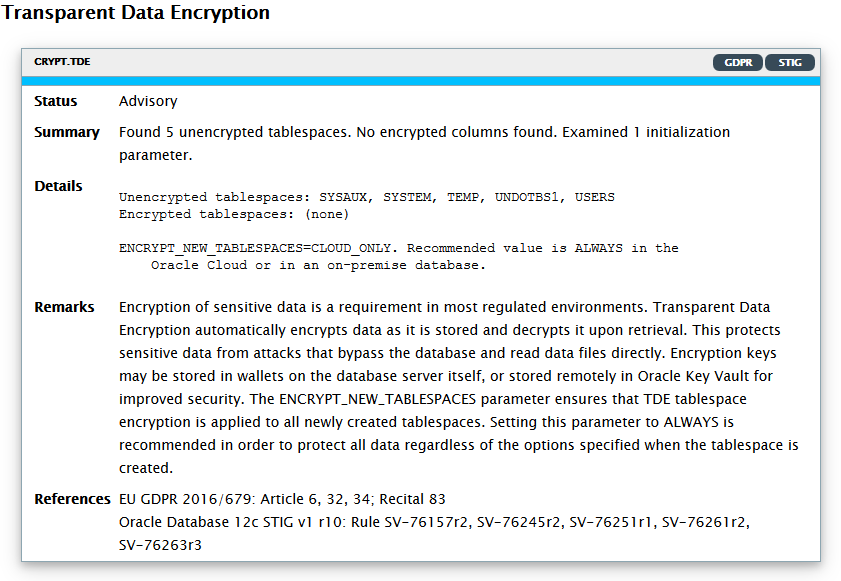

# Lab 3: Transparent Data Encryption

In this lab, we will address the problem of protecting against data theft or loss of disks and backups by encrypting all database files.
Encryption of some sensitive data is a requirement in certain regulated environments. 

## Requirements

- [Lab 02: "Network Encryption"](../lab200/lab200_network_encryption.md) completed. 
- Session open to **secdb** with user **oracle**
- session open to **dbclient** with user **oracle**   

## Review findings from DBSAT

In [Lab 01, DBSAT](../lab100/lab100_dbsat.md) we had the following finding:



**Transparent Data Encryption** automatically encrypts data as it is stored and decrypts it upon retrieval. This protects sensitive data from attacks that bypass the database to read data files directly. Encryption keys may be stored in wallets on the database server itself, or stored remotely in Oracle Key Vault for improved security. The ENCRYPT_NEW_TABLESPACES parameter ensures that TDE tablespace encryption is applied to all newly created tablespaces.

## Configuring Transparent Data Encryption

A software keystore is a container that stores the Transparent Data Encryption master encryption key. 
Before you can configure the keystore, you first must define a location for it in the sqlnet.ora file. There is one keystore per database, and the database locates this keystore by checking the keystore location that you define in the sqlnet.ora file. You can create other keystores, such as copies of the keystore and export files that contain keys, depending on your needs. However, you must never remove or delete the keystore that you configured in the sqlnet.ora location, nor replace it with a different keystore. 

### Set a location for the Wallet (TDE keystore)

Run the following script from a terminal window to the secdb server:

```
[oracle@secdb lab03_tde]$ <copy>cd ~/HOL/lab03_tde/</copy>
```
```
[oracle@secdb lab03_tde]$ <copy>./tde10_wallet_loc.sh</copy>
Adding the following lines to sqlnet.ora:
ENCRYPTION_WALLET_LOCATION =
  (SOURCE =
    (METHOD = FILE)
    (METHOD_DATA =
      (DIRECTORY=$ORACLE_BASE/admin/$ORACLE_SID/tde_wallet)
    )
  )
```

### Creating the Keystore

Run the following script from a terminal window to the **secdb** server:

```
[oracle@secdb lab03_tde]$ <copy>cd ~/HOL/lab03_tde/</copy>
```
```
[oracle@secdb lab03_tde]$ <copy>./tde20_wallet_create.sh</copy>

SQL*Plus: Release 19.0.0.0.0 - Production on Sat May 9 01:18:27 2020
Version 19.6.0.0.0

Copyright (c) 1982, 2019, Oracle.  All rights reserved.

Connected.
SQL> --
SQL> -- create the keystore
SQL> --
SQL> administer key management
  2    create keystore '$ORACLE_BASE/admin/$ORACLE_SID/tde_wallet'
  3    identified by "MyWalletPwd#1";

keystore altered.

SQL>
SQL> --
SQL> -- open the keystore
SQL> --
SQL> administer key management
  2    set keystore open identified by "MyWalletPwd#1"
  3    container=all;

keystore altered.

SQL>
SQL> --
SQL> -- view keystore status
SQL> --
SQL> select * from gv$encryption_wallet;

   INST_ID WRL_TYPE
---------- --------------------
WRL_PARAMETER
--------------------------------------------------------------------------------
STATUS                         WALLET_TYPE          WALLET_OR KEYSTORE FULLY_BAC
------------------------------ -------------------- --------- -------- ---------
    CON_ID
----------
         1 FILE
/u01/oracle/db/admin/CONT/tde_wallet/
OPEN_NO_MASTER_KEY             PASSWORD             SINGLE    NONE     UNDEFINED
         1


SQL>
SQL> exit
Disconnected from Oracle Database 19c Enterprise Edition Release 19.0.0.0.0 - Production
Version 19.6.0.0.0
```
As shown above, the wallet is created as password protected, but is still empty.

### Create a Master Key for pdb1

Run the following script from a terminal window to the **secdb** server:

```
[oracle@secdb ~]$ <copy>cd ~/HOL/lab03_tde/</copy>
```
```
[oracle@secdb lab03_tde]$ ./tde30_create_keys.sh
SQL*Plus: Release 19.0.0.0.0 - Production on Sat May 9 01:22:59 2020
Version 19.6.0.0.0

Copyright (c) 1982, 2019, Oracle.  All rights reserved.

Connected.
SQL> --
SQL> -- create master encryption keys for CDB/PDBs and activate them
SQL> --
SQL> administer key management
  2    set key identified by "MyWalletPwd#1"
  3    with backup using 'backup'
  4    container=all;

keystore altered.

SQL>
SQL> --
SQL> -- view keystore status
SQL> --
SQL> select * from gv$encryption_wallet;

   INST_ID WRL_TYPE
---------- --------------------
WRL_PARAMETER
--------------------------------------------------------------------------------
STATUS                         WALLET_TYPE          WALLET_OR KEYSTORE FULLY_BAC
------------------------------ -------------------- --------- -------- ---------
    CON_ID
----------
         1 FILE
/u01/oracle/db/admin/CONT/tde_wallet/
OPEN                           PASSWORD             SINGLE    NONE     NO
         1


SQL>
SQL> exit
Disconnected from Oracle Database 19c Enterprise Edition Release 19.0.0.0.0 - Production
Version 19.6.0.0.0

```

## Step 2 ##

etc

## Acknowledgements ##

- **Authors** - Adrian Galindo, PTS LAD & François Pons, PTS EMEA - Database Product Management - May 2020.
- **Credits** - This lab is based on materials provided by Oracle Database Security Product Management.