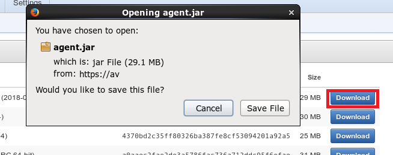
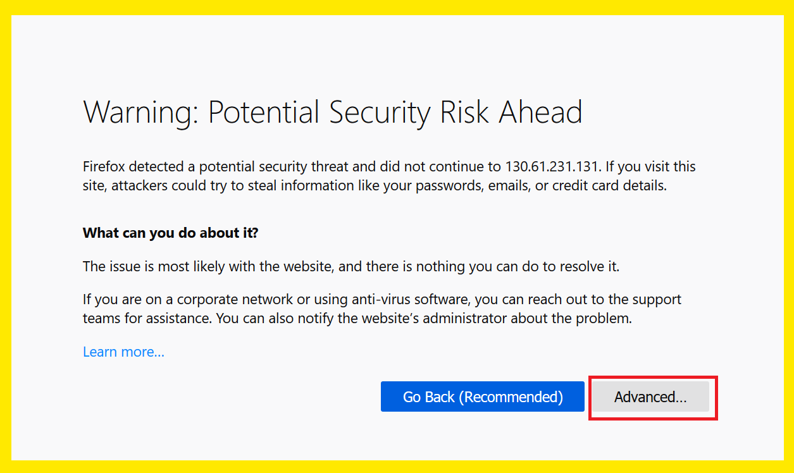
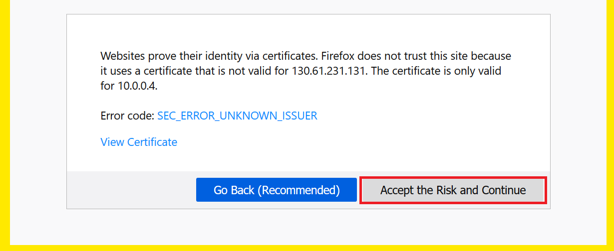

# Title #

This lab will demonstrate how to manage in an Audit Vault Server the audit data produced by an Oracle database.

## Disclaimer ##
The following is intended to outline our general product direction. It is intended for information purposes only, and may not be incorporated into any contract. It is not a commitment to deliver any material, code, or functionality, and should not be relied upon in making purchasing decisions. The development, release, and timing of any features or functionality described for Oracle’s products remains at the sole discretion of Oracle.

## Requirements ##

Instructions in this lab expect that you have completed all the previous labs in the workshop.

## Introduction  ##

A large deployment of Oracle (or non-Oracle) databases can produce a great amount of audit data to consolidate and manage over time. In addition to audit data from databases, other systems such operating systems and file systems produce audit trails that can be used to analyze events relevant to security.

Good practice dictates that audit data should be transmitted to a remote centralized location where it is secure from tampering by the individuals whose activities are being audited.

This is also recommended by DBSAT findings such as the following one:


The Audit Vault Server solves these problems by collecting and consolidating audit data, providing comprehensive reports and alerts for forensic and compliance purposes and managing its retention over time.

In this lab, an Audit Vault Server has already been provisioned in virtual machine **av**. We will register **secdb** as a Secure Target, deploy the **Audit Vault agent** to **secdb** and configure Audit Trails to collect audit data from **secdb**.

## Step 1 : Registering host and deploying the agent ##

First thing to do is to register secdb as a secure target and deploy the agent.

From the **VNC connection to secdb**, start Firefox and connect to the Audit Vault as Super Administrator:

*	URL : **https://av**
*	Username	: **AVADMIN**
*	Password	: **Reganam_1**


Go to **Hosts** > **Register** and enter the following values then click on **Save**.

*	Host name		: **secdb.localdomain**
*	Host IP			: **10.0.0.2**

Make note of the automatically generated **Agent Activation key** (e.g. copy and paste it to **Gedit**)


Now, go to **Hosts (tab)** > **Hosts (menu)** > **Agent** and click on **Download for Agent Release 12.2**.

Save **agent.jar** to ``/home/oracle/HOL/lab08_av``



We can now configure and start the agent.

````
$ <copy>cd /home/oracle/HOL/lab08_av</copy>
````

````
$ <copy>java -jar agent.jar -d /u01/oracle/avagent</copy>

[oracle@secdb lab08_av]$ java -jar agent.jar -d /u01/oracle/avagent
Checking for updates...
Agent is updating. This operation may take a few minutes. Please wait...
Agent updated successfully.
Agent installed successfully.
If deploying hostmonitor please refer to product documentation for additional installation steps.
````

````
$ <copy>cd /u01/oracle/avagent/bin</copy>
````

````
$ <copy>./agentctl start -k</copy>

[oracle@secdb lab08_av]$ cd /u01/oracle/avagent/bin
[oracle@secdb bin]$ ./agentctl start -k
Enter Activation Key:
Agent started successfully.
````

````
$ <copy>./agentctl status</copy>

[oracle@secdb bin]$ agentctl status
Agent is running.
````

## Step 2 : Configuring Audit Trails ##

Now that the agent has been installed and started on secdb, it is possible to connect to Audit Vault from a local browser on your workstation.

You can then connect to the Audit Vault Server console using its public IP at the following URL:

**https://&lt AV PUBLIC IP &gt**

* User Name : **AVADMIN**
* Password  : **Reganam_1**


Allow a security exception as we are just using a self-signed certificate.





Please also accept to run Adobe Flash.


We can now register secure targets and create the audit trails.

Go to **Secured Targets** > **Target** > **Register** and create the following two secure targets.

*	New Secured Target Name: **cont**
*	Description: Container **database**
*	Secured Target Type: **Database**
*	Host name: **secdb**
*	Port: **1521**
*	Service Name: **cont**
*	Username: **system**
*	Password: **MyDbPwd#1**

Click on **Save** in the upper right corner.

*	New Secured Target Name: **pdb1**
*	Description: Pluggable **database**
*	Secured Target Type: **Database**
*	Host name: **secdb**
*	Port: **1521**
*	Service Name: **pdb1**
*	Username: **system**
*	Password: **MyDbPwd#1**

Click on **Save** in the upper right corner.


Let’s collect audit data created inside the database (view UNIFIED_AUDIT_TRAIL) and in operating system files (as per parameter audit_file_dest = /u01/oracle/admin/CONT/adump).

Go to **Secured Targets** > **Audit Trails** > **Add** and create the following three audit trails.

*	audit trail type: **TABLE**
*	collection host: **secdb.localdomain**
*	secured target: **cont**
*	trail location: **UNIFIED_AUDIT_TRAIL**
*	collection plugin: **com.oracle.av.plugin.oracle**


*	audit trail type: **TABLE**
*	collection host: **secdb.localdomain**
*	secured target: **pdb1**
*	trail location: **UNIFIED_AUDIT_TRAIL**
*	collection plugin: **com.oracle.av.plugin.oracle**


*	audit trail type: **DIRECTORY**
*	collection host: **secdb.localdomain**
*	secured target: **cont**
*	trail location: **/u01/oracle/db/admin/CONT/adump**
*	collection plugin: **com.oracle.av.plugin.oracle**

The collection should start automatically after a few seconds. The Collection Status arrows will change from down (Red Arrow Down) to up (Green Arrow Up).


## Acknowledgements ##

- **Authors** - Adrian Galindo & François Pons, PTS EMEA - April 2020.
- **Credits** - This lab is based on materials provided by Oracle Database Security Product Management.
